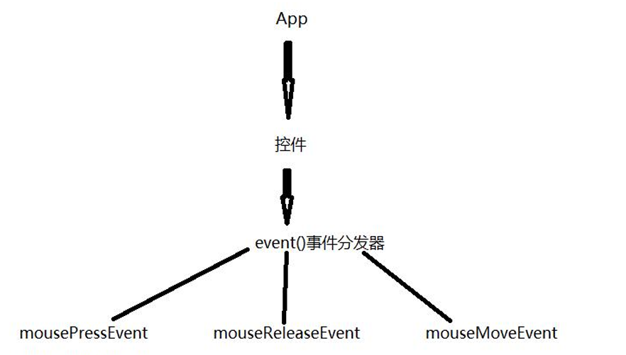

# QT项目

在继承自QWidget类的用户类中无法创建菜单栏等几种行为,而mainwindow可以

## pro工程文件

```properties
# coreQt 的核心代码 gui是Qt图形界面的核心代码
QT   += core gui

#Qt4的widgets组件包含在gui里面但是Qt5将widgets从gui单独拿出来
greaterThan(QT_MAJOR_VERSION,4):QT += widgets

#TARGET就是可执行文件
TARGET=00_code

#app表示咱们的工程是应用开发程序
TEMPLATE=app
DEFINES+=QT_DEPRECATED_WARNINGS
SOURCES+=main.cpp\
widget.cpp
HEADERS +=widget.h
```

## main.cpp

```c++
#include"widget.h"
//QApplication应用程序头文件
#include<QApplication>
int main(int argc,char * argv[])
{
    //a表示是应用程序对象
    QApplication a(argc,argv);
    //主窗口w主窗口的设计一般在主窗口类的构造函数中完成
    Widget w;
    //窗口默认不显示需要调用show才显示如果隐藏窗口hide()
    w.show();
    //exec是主事件循环（带阻塞），响应界面上的所有动作
    return a.exec();
}
```

##  widget.cpp

```c++
#include"widget.h"
Widget::Widget(QWidget *parent)
    :QWidget(parent)
    {
        //设计主窗口
    }
Widget::~Widget()
{
}
```

##  widget.h

```c++
#ifndefWIDGET_H
#defineWIDGET_H
#include<QWidget>
class Widget:public QWidget
{
    //Q_OBJECT描述该类支持信号和槽机制
    Q_OBJECT
        public:
    Widget(QWidget *parent=0);
    ~Widget();
};
#endif//WIDGET_H
```

# 窗口基本设置

```c++
Widget::Widget(QWidget *parent)
    : QWidget(parent)
    {

        this->setWindowTitle("窗口");   //标题
        //    this->resize(500,200);        //窗口大小
        this->resize(QSize(400,200));        //传递QSize对象设置窗口大小
        this->setFixedHeight(200);      //设置高度固定为200，不可拉长
    }
```

# 按钮

添加按钮需要引入头文件：

**注意**：==在qt中创建任何组件最好都最好**使用new**，这样方便qt进行内存管理==。

```c++
#include <QPushButton>
```

```c++
#include "QPushButton"
Widget::Widget(QWidget *parent)
    : QWidget(parent)
    {
        QPushButton *btn1=new QPushButton;
        //    QPushButton *btn1=new QPushButton("文本",this);  //这样可直接生成按钮文本和设置父对象
        btn1->setText("点击");  //设置按钮文本
        btn1->setParent(this);  //设置按钮的父对象
        //    btn1->show(); //  如果对按钮使用show，则会独立一个窗口出来显示
        btn1->move(200,100);  //设置坐标，坐标原点为窗口右上角，按钮锚点也是在左上角
    }
```

# 对象模型（对象树）

在创建 QObject 对象时，可以提供一个给它父对象。

- 创建的这个 QObject 对象会自动添加到其父对象的 children()列表。

- 当父对象析构的时候，这个列表中的所有对象也会被析构。

- **注意**：这里的父对象并不是继承意义上的父类！

-  可以自己删除子对象，它们会自动从其父对象列表中删除。 

- **建议**：所有的控件 都是用new创建，设置好父对象。

# 信号和槽

## 信号和槽机制

- 第一步:事先建立信号和槽的关系 【connect：连接】

  - ```
    connect(信号的发起者，信号，接收者，槽函数);
    ```

- 第二步: 信号一旦发生，槽函数立即执行

## 信号文档(signal)


## 槽函数文档(slot)


## 案例：单击按钮关闭窗口

```c++
Widget::Widget(QWidget *parent)
    : QWidget(parent)
    {
        QPushButton *btn1=new QPushButton("关闭");
        btn1->setParent(this);
        //Q5的连接方式
        connect(btn1,&QPushButton::clicked,this,&Widget::close);
        //Q4的连接方式
        //    connect(btn1,SIGNAL(clicked(bool),this,SLOT(close());
    }
```

## 自定义信号和槽

场景：老师 饿了 学生请客吃饭 

老师和学生控件 **必须继承Qt已有的控件类型**。

### 创建控件类


```c++
//widget.h中 为了方便可以直接在类中直接使用自定义控件，直接将自定义控件指针，声明为widget的公开属性。
ifndef WIDGET_H
    #define WIDGET_H

    #include <QWidget>
    #include "teacher.h"
    #include "student.h"
    class Widget : public QWidget
    {
        Q_OBJECT

            public:
        Widget(QWidget *parent = 0);
        ~Widget();
        QPushButton *btn=new QPushButton("吃饭",this);
        this->setFixedSize(400,300);
        btn->move(10,10);
        //下方的stu，student都是控件，不过无法显示，如果不移动位置，则会重叠导致无法点击
        Student *stu;
        Teacher *tea;
        connect(this->tea,&Teacher::hugry,this->stu,&Student::eating);

    };

#endif // WIDGET_H


//--------------------在widget.cpp中-----------、
this->stu=new Student(this);
this->tea=new Teacher(this);
```

### 自定义信号

- 在**发出信号的控件类**的==signals==处设置 自定义信号
- 自定信号不需要函数体，可以有参数，信号可以重载，返回值为void

```c++
//teacher.h
class Teacher : public QWidget
{
    Q_OBJECT
        public:
    explicit Teacher(QWidget *parent = 0);

    signals:
    void hugry();
};
```

### 自定义槽函数

- 在**接收信号的控件类**的==public slots==处设置 自定义槽函数
- 槽函数 : 返回值为void可以有参数，可以重载，必须有函数体

```c++
//student.h
#ifndef STUDENT_H
#define STUDENT_H
#include <QDebug>
#include <QWidget>

class Student : public QWidget
{
    Q_OBJECT
        public:
    explicit Student(QWidget *parent = 0);

    signals:

    public slots:
    void teaing(){
        qDebug()<<"请吃烦"<<endl;
    }
};

#endif // STUDENT_H

```

### emit发送信号

```c++
emit 控件类对象->信号函数();
```

```c++
//在点击按钮后 发送信号
//-------widget函数声明按钮，并为按钮连接teacher的槽函数
connect(btn,QPushButton::clicked,tea,Teacher::goEating)
```

```c++
class Teacher : public QWidget
{
    Q_OBJECT
        public:
    explicit Teacher(QWidget *parent = 0);

    signals:
    void hugry();

    public slots:
    void goEating(){
        emit this->hugry();
    }
};
```

### 兼容qt4

```c++
#define QT5   //利用宏来手动决定在那种环境下编译

#ifdef Qt5
connect(tea,&Teacher::hungry,stu,&Student::treating);
connect(btn,&QPushButton::clicked,tea,&Teacher::classOver);
#endif
//Qt4的方式
#ifdef Qt4
connect(tea,SIGNAL(hungry()),stu,SLOT(treating()));
connect(btn,SIGNAL(clicked(bool)),tea,SLOT(classOver()));
#endif
```

### 带参的自定义信号和槽

```c++
//teacher.h
class Teacher : public QWidget
{
    Q_OBJECT
        public:
    explicit Teacher(QWidget *parent = 0);

    signals:
    void hugry();
};
```

### 带参的槽函数

```c++
public slots:
    void eating(QString foodName){
              qDebug()<<"请吃烦 "<<foodName<<endl;
    }
};
```

### 关联带参信号与槽函数

- Qt4 的SIGNAL、SLOT 都是将信号和槽函数当成字符串处理 不会做语法检查。
-  Qt5 直接取信号和槽的入口地址，会做语法检查

```c++
//有时可能存在 既有无参信号 又有 带参信号的情况
//此时 使用
// connect(this->tea,&Teacher::hugry,this->stu,&Student::eating);
//由于&Teacher::hugry 只是一个函数入口地址，无法分辨应该调用哪一个函数，存在二义性，而报错
//只能通过函数指针来解决
void (*p)(QString)=&Teacher::hugry;
//这表示了一个参数为QString的函数指针，但是依旧会报错
//因为此时的p只是一个普通的函数指针变量，只能保存普通函数的入口地址
//而 &Teacher::hugry 是属于Teacher类的成员函数
//所以p必须也是属于类的函数的函数指针，因此需要声明属于Teacher类的成员函数
this->stu=new Student(this);
this->tea=new Teacher(this);
void (Teacher :: *p1)(QString)=&Teacher::hugry;
void (Student :: *p2)(QString)=&Student::eating;
connect(this->tea,p1,this->stu,p2);
connect(btn,QPushButton::clicked,this->tea,Teacher::goEating);


//qt4写法
connect(tea,SIGNAL(hugry(QString)),stu,SLOT(treating(QString)));
connect(btn,SIGNAL(clicked(bool)),tea,SLOT(classOver()));
```

### 发送参数

```c++
class Teacher : public QWidget
{
    Q_OBJECT
        public:
    explicit Teacher(QWidget *parent = 0);

    signals:
    void hugry(QString foodName);

    public slots:
    void goEating(){
        emit this->hugry("锅包肉");
        //这里调用信号函数，将参数发送给信号函数再传递给学生的槽函数
    }
};
```

## 信号和槽的关系

- **一个信号可以和多个槽相连** 
  - 一旦信号发生 所有槽函数都会执行（执行顺序不确定）
-  **多个信号可以连接到一个槽** 
  - 任何一个信号发生 槽函数都会执行
-  **一个信号可以连接到另外的一个信号** 
  - 一般用无参的信号和槽。 
- **信号槽可以断开** 
  - 利用 **disconnect** 关键字是可以断开信号槽 
- **connect的第5个参数**
  -  connect 第 5 个参数强调的是连接类型 ，默认是
  - `Qt :: AutoConnection`。

# lambda表达式

```c++
widget::Widget(Qwidget *parent)
    :Qwidget(parent)
    {
        setFixedSize(400,300);
        static QPushButton *btn = new QPushButton("按钮" , this);
        btn->move( 300,0);
        static QLabel *label=new QLabel("我是label", this);
        // lambda表示
        connect( btn,&QPushButton::clicked,[&](){
            label->setText( "xixixix" );
        });
    }

```

# QMainWindow

==创建项目时，基类需要设置为QMainWindow==。

## 菜单栏

```c++
#include "mainwindow.h"
#include "QMenuBar"  //菜单栏头文件
#include "QAction"  //菜单项头文件
#include "QDebug"
MainWindow::MainWindow(QWidget *parent)
    : QMainWindow(parent)
    {
        this->resize(800,600);
        QMenuBar *mBar=new QMenuBar(this);
        // 将菜单栏放入主窗口的菜单栏该有的位置,否则会被当成按钮控件
        this->setMenuBar(mBar);


        //创建菜单
        QMenu *file=new QMenu("文件",this);
        QMenu *edit=new QMenu("编辑",this);
        //将菜单添加至菜单栏
        mBar->addMenu(file);
        mBar->addMenu(edit);

        //创建菜单项
        QAction *NEW=new QAction("新建",this);
        QAction *OPEN=new QAction("打开",this);
        file->addAction(NEW);
        //添加菜单项分割线
        file->addSeparator();
        file->addAction(OPEN);


        //为菜单项绑定事件--  lambda表达式版
        //      connect(NEW,&QAction::triggered,[&](){
        //               qDebug()<<"文件新建"<<endl;
        //      });
        //为菜单项绑定事件--  槽函数
        connect(NEW,&QAction::triggered,this,MainWindow::openFunc);

        //设置new的快捷方式
        //    QKeySequence (QKeySequence:: Print);
        //    QKeySequence (tr ("ctr1+P"));
        //    QKeySeguence (tr ("ctrl+p"));
        //    QKeySequence (Qt::CTRL+ Qt::Key_P);

        NEW->setShortcut(QKeySequence(tr("ctrl+l")));
        OPEN->setShortcut(QKeySequence(Qt::CTRL+ Qt::Key_O));
    }
```

## 工具栏

```c++
#include  "QToolBar"   //工具栏头文件
```

```c++
//创建工具栏
QToolBar *QtoolBar=new QToolBar(this);
this->addToolBar(QtoolBar);

//为工具栏添加选择项
QtoolBar->addAction(NEW);
QtoolBar->addAction(OPEN);
//设置工具栏不支持浮空
QtoolBar->setFloatable(false);
//设置工具栏停靠的位置,这里设置为只允许停靠在左边或者右边
QtoolBar->setAllowedAreas(Qt::LeftToolBarArea|Qt::RightToolBarArea);
```

## 状态栏

```c++
#include "QStatusBar"    //状态栏
```

```c++

//创建状态栏
QStatusBar *status=new QStatusBar(this);
//将状态栏添加到主窗口
this->setStatusBar(status);
//添加左侧栏控件
QLabel *label=new QLabel("左侧提示",this);
status->addWidget(label);
//添加右侧栏控件
QLabel *rlabel=new QLabel("右侧提示",this);
status->addPermanentWidget(rlabel);
```

## 中心部件

```c++
//创建中心部件
//【不是单指某一个部件，是把哪一个部件放在中心部件区，那个就是中心部件】
QTextEdit *editText=new QTextEdit("文本编辑",this);
//此时editText还是一个普通的部件
//将editText添加到中心部件
this->setCentralWidget(editText);
```

## 铆接部件

```c++
#include "QDockWidget"
```

```c++
//创建铆接部件
QDockWidget *dock=new QDockWidget("铆接",this);
//添加铆接部件
this->addDockWidget(Qt::TopDockWidgetArea,dock);
//设置可停靠区域
dock->setAllowedAreas(Qt::TopDockWidgetArea|Qt::BottomDockWidgetArea);
```

# 资源文件

Qt 资源系统是一个跨平台的资源机制，用于将程序运行时所需要的**资源以二进 制的形式 ==存储于可执行文件内部==**。

## 将所需要的图片放入工程目录


## 创建资源文件

- 在项目文件中点击 **添加新文件**。
- 在**qt类**中选择  ==**Qt Resource File**==。
- 取 资源文件名 一般叫做**res**

## 给资源文件添加资源

- 创建资源文件后，会出现资源文件夹 ，资源文件夹中会出现新建的资源文件
  - 资源文件名为  `资源文件名.qrc`  如结合上方这里名为`res.qrc`

- 点击资源文件
- 点击资源文件后下方有  ==添加== 选项 点击选择 ==添加前缀==。
- 输入前缀为 ==/== 【也可以是其他的前缀，不建议太长】。
- 输入前缀后，再次选择 ==添加文件==。
- 选择想要添加的文件
- 选择后点击 **==在qt creator 窗口==左下角有个锤子图标（构建）**

**注意**：删除资源文件时，**不可以从文件目录中删除**，而应该在资源文件的管理界面中【右击.qrc文件 选择Open in Editor进入】 点击删除按钮 然后重写构建

## 中途添加新的图片

- 右击.qrc文件 
- 选择Open in Editor进入资源管理界面
- 重复添加资源操作

## 使用资源文件


```c++
//设置主窗口的 图标
setWindowIcon(QIcon(":/image/LuffyQ.png"));
New->setIcon(QIcon(":/image/New.png"));
Open->setIcon(QIcon(":/image/Edit.png"));
```

# UI文件

创建项目时 勾选  **创建界面**


图中右键绑定信号与槽 是完全交由UI来完成，只需要自行完成槽函数功能即可

## 通过代码绑定信号与槽函数

使用ui时，一切都是基于ui组件来完成，因此新建的UI控件都属于ui,需要经过UI来控制

```c++
MainWindow::MainWindow(QWidget *parent) :
QMainWindow(parent),
ui(new Ui::MainWindow)
{
    ui->setupUi(this);
    connect(ui->open,&QPushButton::clicked,this,&MainWindow::btn_fun);
}

MainWindow::~MainWindow()
{
    delete ui;
}

void MainWindow::on_actionNew_triggered()
{
    qDebug()<<"槽函数"<<endl;
}

void MainWindow::btn_fun()
{
    QMessageBox::warning(this,"警告","肩高将");
}

```

```c++
class MainWindow : public QMainWindow
{
    //.......

    private slots:
    void on_actionNew_triggered();
    void btn_fun();
    private:
    Ui::MainWindow *ui;
};


```


# 对话框

### 对话框的分类

对话框分为模态对话框和非模态对话框。

**模态对话框**：就是会阻塞同一应用程序中其它窗口的输入【存在时，只允许操作该对话框】。 

与此相反的是非模态对话框。

- 使用 `QDialog::exec()`实现应用程序级别的模态对话框 
- 使用 `QDialog::open()`实现窗口级别的模态对话框 
- 使用 `QDialog::show()`实现非模态对

### 消息对话框QMessageBox

```
#include "QMessageBox"
```


```
QMessageBox::information(this,"信息","余额不足");
```

```
QMessageBox::warning(this,"警告","必须充值");
```

```
QMessageBox::critical(this,"错误","用户或密码错误");
```

```c++
//信息确认框
void MainWindow::btnFunc()
{
    //声明一个选择选项枚举变量 用来接受返回的值
    QMessageBox::StandardButton ret;
     //这里会将选择的选项的枚举值返回
    //QMessageBox::question 信息确认框
    ret = QMessageBox::question(this,"询问","是否下载该视频",QMessageBox::Save|QMessageBox::Cancel);
    if(ret==QMessageBox::Save)
    {
        qDebug()<<"客官请稍等，视频下载中......"<<endl;
    }
    else if(ret==QMessageBox::Cancel)
    {
        qDebug()<<"客官不喜欢吗？"<<endl;
    }
}
```

### 文件对话框

```c++
#include "QFileDialog"
void MainWindow::on_actionOpen_triggered()
{
    QStringfileName=QFileDialog::getOpenFileName(this,"文件","./","*.cpp");
    qDebug()<<fileName<<endl;
}
```

### 字体对话框

```c++
#include "QFontDialog"
void MainWindow::on_actionfont_triggered()
{
    bool yes;
    QFont font = QFontDialog::getFont(&yes,QFont("宋体"),this,"字体");
    qDebug()<<font.family()<<" "<<font.pointSize()<<endl;
}
```

### 颜色对话框

```c++
#include "QColorDialog"
void MainWindow::on_actioncolor_triggered()
{
    QColor color= QColorDialog::getColor();
    qDebug()<<color.red()<<" "<<color.green()<<" "<<color.blue()<<endl;
}

```

# UI的布局

- 水平从左到右布局[QHBoxLayout]
- 竖直从上到下布局[QVBoxLayout]

- 网格布局[QGridLayout]

# 窗口切换案例

## 基本布局


可在输入框的属性 `echoMode`属性设置为 `Password` ，变为密码输入框

## 获取输入框内容

- 为 登录和取消  按钮 转到 槽函数

```c++
//登录按钮槽函数
void Widget::on_loginBtn_clicked()
{
    QString username=ui->username->text();
    QString pwd=ui->password->text();
    if(username=="admin" &&pwd=="123456"){
        //跳到新的页面
        qDebug()<<"欢迎来到召唤师峡谷"<<endl;
    }else{
        QMessageBox::warning(this,"错误","密码错误");
        ui->username->setText("");
        ui->password->setText("");
    }
}
```

## 创建新的窗口类

- 右击项目 添加新文件
- 在QT类下 选择 Qt设计师界面类

- 选择所需窗口

## 定义新窗口指针

在窗口切换时，需要去new 一个新的窗口，需要在当前窗口中的类的成员函数中去使用，此时新窗口的指针变量应该定义为当前窗口的头文件中的类成员

```c++
//在主窗口的头文件中
#include "newwidget.h"
class Widget : public QWidget
{
    //。。。。。。。。。

    private:
    Ui::Widget *ui;
    newWidget *newWin;
};
```

## 构造函数中创建一个新的窗口

```c++
Widget::Widget(QWidget *parent) :
QWidget(parent),
ui(new Ui::Widget)
{
    ui->setupUi(this);
    //这里不可以直接指定父窗口为主窗口，负责会导致该窗口直接在父窗口中显示
    //    this->newWin=new newWidget(this);
    //直接创建一个新窗口即可
    this->newWin=new newWidge;
}
```

## 切换到新窗口

```c++
void Widget::on_loginBtn_clicked()
{
    QString username=ui->username->text();
    QString pwd=ui->password->text();
    if(username=="admin" &&pwd=="123456"){
        //跳到新的页面
        this->hide();   //主窗口隐藏
        this->newWin->show();  //显示新窗口
    }else{
        QMessageBox::warning(this,"错误","密码错误");
        ui->username->setText("");
        ui->password->setText("");
    }
}
```

##  回退到主窗口

- 首先由于是新窗口发出信号，因此在新窗口的类中自定义信号

  - ```c++
    signals:
        void newBack();
    ```

- 然后在新窗口的回退按钮 转到槽函数 ==只用于**发送回退信号**==。

  - ```c++1
    emit newBack();
    ```

- 新窗口的指针变量是主窗口的成员，所以主窗口是知道两者的状态的

- 因此，可以**在主窗口中 关联 回退信号 与 回退槽函数**

  - ```c++
    //connect(新窗口,回退信号,主窗口，回退槽函数);
    connect(newWin,newWidget::newBack,this,this->goMain);   //qt5
    //    connect(newWin,SIGNAL(newBack()),this,SLOT(goMain())); //qt4
    ```

- 回退槽函数

  - ```c++
    void Widget::goMain()
    {
        this->show();
        this->newWin->hide();
    }
    ```

# 控件

## QLabel

### 操作文本

```c++
//获取label的文本
Qstring text = ui->label->text();
//设置新的文本
ui->label->setText("我是新数据");
```

### 操作图片

```c++
void MainWindow::on_pushButton_clicked()
{ 
    QString arr[]={":/image/down.png",":/image/up.png"};
    static int flag=0;
    static int x=0;
    //设置label的图片
    QPixmap pix;
    //pix加载一张图片
    pix.load(arr[flag]);
    //修改图片的大小
    pix.scaled(ui->label_2->width(),ui->label_2->height());
    //将pix设置到label中
    ui->label_2->setPixmap(pix);

    //点击切换图片
    flag=!flag;
    //移动label
    ui->label_2->move(x,ui->label_2->y());
    //每次点击向右偏移10像素，超过窗口宽度时 重新回到窗口左侧
    x+=10;
    if(x>this->width()){  
        x=0;
    }
}
```

### 显示动画

```c++
//考虑到动画的后续 操作，设置该动画为主窗口属性
#include <QMovie>
class MainWindow : public QMainWindow
{
    //。。。。。。
    private:
    Ui::MainWindow *ui;
    QMovie *qmovie;
};
```

```c++
//为动画绑定动画文件
MainWindow::MainWindow(QWidget *parent) :
QMainWindow(parent),
ui(new Ui::MainWindow)
{
    ui->setupUi(this);
    //设置动画
    this->qmovie=new QMovie(":/image/mario.gif");
    //给label播放动画
    ui->labelAni->setMovie(qmovie);
}
```

```c++
//播放和暂停动画
this->qmovie->start();

this->qmovie->stop();
```

## 单选框

- 可在 button ui类中拖动**radio button**单选框至窗口使用
- 如果只是简单的拖动至窗口使用，会导致所有的单选框被视为一组
- 可拖动==container== UI 类中的 ==Group Box==来手动为单选框分组

## 复选框

checkBox

## 列表控件 listWidget

```c++
#include <QListWidget>
Widget::Widget(QWidget *parent) :
QWidget(parent),
ui(new Ui::Widget)
{
    ui->setupUi(this);
    //给 listWidget 添加一个控件
    ui->listWidget->addItem("德玛西亚");
    //给 listWidget 添加多个控件
    QStringList list;
    list<<"小炮"<<"寒冰"<<"烬";
    ui->listWidget->addItems(list);
    //设置list 控件透明
    ui->listWidget->setStyleSheet("background-color:transparent");
    connect( ui->listWidget, &QListWidget::itemClicked, this, &Widget::listWidgetFunc );
}
void Widget::listWidgetFunc(QListWidgetItem *item)
 {
 qDebug()<<"你选择的英雄为:"<<item->text()<<endl;
 }
```

## 树控件 QTreeWidget

拖动至窗口后 可双击添加属性和列

```c++
connect( ui->treeWidget,&QTreeWidget::itemClicked, this, &Widget::treeWdigetFunc );


void Widget::treeWdigetFunc(QTreeWidgetItem *item, int col)
{
    qDebug()<<"选中的内容为:"<<item->text(col)<<endl;
}

```

## 表格控件 QTableWidget

```c++
connect( ui->tableWidget,&QTableWidget::cellClicked, [&](int row, int col){
    qDebug()<<ui->tableWidget->item(row,col)->text();
}
       );
```

##  工具盒子[折叠] QToolBox

## 下拉列表框 QComboBox

```c++
//QComboBox::currentIndexChanged信号发生了重载 需要使用指针解决（Qt5的方式）
void (QComboBox:: *p1)(int) = &QComboBox::currentIndexChanged;
connect( ui->comboBox, p1 , [&](int index){
    qDebug()<<ui->comboBox->itemText(index)<<endl;
} );
```

## 自定义控件

- 在搭建 Qt 窗口界面的时候，在一个项目中很多窗口，或者是窗口中的某个模块 会被经常 性的重复使用。
- 将这个窗口或者模块拿出来 做成一个独立的窗口类，以备以后重复使用， 而这个独立的窗口类 叫做自定义控件。


### 将控件提升为自定义控件

- 右击想要提升为 自定义控件的 widget控件
- 选择==提升为==。

- 在 `提升的类名称`中输入刚才新建的 widget类名

- 单机添加，选中想要使用的自定义控件，然后点击提升
- 但是主窗口依旧是空白的，运行后可见

### 定义自定义控件功能

```c++
temWidget::temWidget(QWidget *parent) :
QWidget(parent),
ui(new Ui::temWidget)
{
    ui->setupUi(this);

    //修改spinbox 影响 slider
    void (QSpinBox :: *p)(int)=&QSpinBox::valueChanged;
    //QSlider从文档中无法查找到槽函数，因此直接查看父类 发现有setVlaue槽函数
    connect(ui->spinBox,p,ui->horizontalSlider,QSlider::setValue);

    //QSlider从文档中无法查找到信号，因此直接查看父类 发现有valueChanged信号
    connect(ui->horizontalSlider,QSlider::valueChanged,ui->spinBox,QSpinBox::setValue);
}
```

### 自定义控件提供公共方法在其他UI操作

```c++
//自定义控件中设置公共方法
class temWidget : public QWidget
{
//。。。。。。。。。。。
public:
    explicit temWidget(QWidget *parent = 0);
    ~temWidget();
    //提供公共方法
    void setSliderVlaue(int value);
};
```

```c++
void temWidget::setSliderVlaue(int value)
{
    ui->horizontalSlider->setValue(value);
}
```

## tab切换页 tabWidget

## stackWdiget

# 事件

Qt 中所有事件类都继承于 QEvent,。

event()函数并不直接处理事件，而是按照事件对象的类型分派给特定的事件处理函数.

- keyPressEvent()  键盘按下
- keyReleaseEvent()  键盘升起
- mouseDoubleClickEvent()   双击
-  mouseMoveEvent()   鼠标移动
- mousePressEvent()   鼠标按下
- mouseReleaseEvent() 等   鼠标升起

这些函数都是 ==protected virtual==。

mylabel.h：

```c++
#ifndef MYLABEL_H
#define MYLABEL_H
#include <QWidget>
#include <QLabel>
class MyLabel : public QLabel
{
    Q_OBJECT
        public:
    explicit MyLabel(QWidget *parent = 0);
    //重写键盘或鼠标事件
    virtual void keyPressEvent(QKeyEvent *ev);
    virtual void mouseMoveEvent(QMouseEvent *ev);
    virtual void mousePressEvent(QMouseEvent *ev);
    virtual void mouseReleaseEvent(QMouseEvent *ev);
    virtual void enterEvent(QEvent *event);
    virtual void leaveEvent(QEvent *event);
    signals:
    public slots:
};
#endif//MYLABEL_
```

mylabel.cpp:

```c++
#include"mylabel.h"
#include<QDebug>
#include<QMouseEvent>
MyLabel::MyLabel(QWidget*parent):QLabel(parent)
{
    //设置鼠标不按下也移动
    this->setMouseTracking(true);
}
void MyLabel::keyPressEvent(QKeyEvent*ev)
{
    if(ev->key()==Qt::Key_Q)
    {
        qDebug()<<"释放天音波"<<endl;
    }
    elseif(ev->key()==Qt::Key_W)
    {
        qDebug()<<"释放金钟罩"<<endl;
    }
}
voi dMyLabel::mouseMoveEvent(QMouseEvent*ev)
{
    qDebug()<<"鼠标移动了x="<<ev->x()<<"y="<<ev->y() <<endl;
}
void MyLabel::mousePressEvent(QMouseEvent*ev)
{
    //判断鼠标哪个键按下
    if(ev->button()==Qt::LeftButton)
    {
        qDebug()<<"鼠标左键按下了x="<<ev->x()<<"y="<<ev->y()<<endl;
    }
    else if(ev->button()==Qt::RightButton)
    {
        qDebug()<<"鼠标右键按下了x="<<ev->x()<<"y="<<ev->y()<<endl;
    }
    else if(ev->button()==Qt::MidButton)
    {
        qDebug()<<"鼠标中键按下了x="<<ev->x()<<"y="<<ev->y()<<endl;
    }
}
void MyLabel::mouseReleaseEvent(QMouseEvent *ev)
{
    qDebug()<<"鼠标释放了"<<endl;
}
void MyLabel::enterEvent(QEvent* event)
{
    qDebug()<<"鼠标进入了"<<endl;
}
void MyLabel::leaveEvent(QEvent *event)
{
    qDebug()<<"鼠标离开了"<<endl;
}
```

## QEvent事件分发器



- event()函数主要用于事件的分发。
- 如果希望在事件分发之前做一些操作，就可以重写这个 event()函数了。
- 如果传入的事件已被识别并且处理，则需要返回 true，否则返回 false。 
  - 如果返回值是 true，那么 Qt 会认为这个事件已经处理完毕，不会再将这 个事件发送给其它对象，而是会继续处理事件队列中的下一事件。

```c++
bool MyLabel::event(QEvent *e)
{
    //一定要判断事件的类型
    if(e->type() == QEvent::MouseButtonPress)
    {
        QMouseEvent *ev = (QMouseEvent *)(e);
        qDebug()<<"分发器中 鼠标按下了 x="<<ev->x()<<"y="<<ev->y()<<endl;
        return true;
    }
    //其他不关心的事件 交给父类的分发器完成,如果不执行这一步会导致其他时间无法处理，
    //导致控件出现无法显示等问题
    return QLabel::event(e);
}
```

## 事件过滤器


```c++
//1、安装事件过滤器（控件的构造函数中）
void installEventFilter(QObject *filterObj);
//2、重写事件过滤器函数 watched响应的控件 event：控件的具体事件
virtual bool eventFilter(QObject *watched, QEvent *event)；
```

```c++
bool MyLabel::eventFilter(QObject *watched, QEvent *event)
{
    //判断哪个控件触发了 watched是被触发的控件
    if(watched == this)//MyLabel 控件触发了
    {
        //一定要判断事件的类型
        if(event->type() == QEvent::MouseButtonPress)
        {
            QMouseEvent *ev = (QMouseEvent *)(event);
            qDebug()<<"过滤器中 鼠标按下了 x="<<ev->x()<<"y="<<ev->y()<<endl;
            return true;
        }
    }
    return QLabel::eventFilter(watched, event);
}
```

# 定时器

## 定义定时器

```c++
class Widget : public QWidget
{
    Q_OBJECT
public:
    explicit Widget(QWidget *parent = 0);
    ~Widget();
    //定义两个定时器id
    int id1;
    int id2;
    void timerEvent(QTimerEvent *event);
private:
    Ui::Widget *ui;
};
```

```c++

Widget::Widget(QWidget *parent) :
QWidget(parent),
ui(new Ui::Widget)
{
    ui->setupUi(this);
    //开启定时器 单位为毫秒
    id1 = startTimer(1000);//每隔1 秒触发一次
    id2 = startTimer(2000);//每隔2 秒
}

void Widget::timerEvent(QTimerEvent *event)
{
    static int timer1 = 0;
    static int timer2 = 0;
    //判断哪个定时器触发了
    if(event->timerId() == id1)
    {
        //给 label 显示数值
        timer1++;
        ui->label->setText(QString::number(timer1));
    }
    if(event->timerId() == id2)
    {
        timer2++;
        ui->label_2->setText(QString::number(timer2));
    }
}
```

## 通过定时器对象 完成定时

```c++
//头文件 定义各个定时器对象
class Widget : public QWidget
{
    Q_OBJECT
        public:
    explicit Widget(QWidget *parent = 0);
    ~Widget();
    QTimer *timer;
    private:
    Ui::Widget *ui;
};
```


```c++
Widget::Widget(QWidget *parent) :
QWidget(parent),
ui(new Ui::Widget)
{
    ui->setupUi(this);
    //构造函数中 定义一个定时器对象
    timer = new QTimer(this);
    //监听超时信号
    connect(timer, &QTimer::timeout,this, &Widget::myTimeoutFunc );
}


void Widget::on_startBtn_clicked()
{
    timer->start(1000);//开启一个每隔一秒触发一次的定时器
}
void Widget::on_stopBtn_clicked()
{
    timer->stop();
}
void Widget::myTimeoutFunc()
{
    static int time=0;
    time++;
    ui->label_3->setText(QString::number(time));
}

```

## 通过定时器的静态函数 完成延时【触发一次】

```c++
QTimer::singleShot (5000，[&](){
    ui->label_4->setText("哈哈");
});

```

# 绘图

整个绘 图系统基于 ==QPainter，QPainterDevice 和 QPaintEngine== 三个类。：

- **QPainter**： 用来执绘图操作。 
- **QPaintDevice**： 是一个二维空间的抽象，这个二 维空间允许 QPainter 在其上面进行绘制， 也就是 QPainter 工作空间。 
- **QPaintEngine**： 提供了画笔（QPainter）在不同的设备上进行绘制的统一的接口。


## 绘制背景图片

```c++
class Widget : public QWidget
{
    Q_OBJECT

public:
    explicit Widget(QWidget *parent = 0);
    ~Widget();
    //重写绘图事件(窗口加载或调用update函数就会调用绘图事件)
    virtual void paintEvent(QPaintEvent *event);
private:
    Ui::Widget *ui;
};
```

```c++
void Widget::paintEvent(QPaintEvent *event)
{
    QString arr[]={":/image/up.png",":/image/down.png"};
    int n=sizeof(arr)/sizeof(arr[0]);
    //定义一个画家this表示在主窗口上绘制
    QPainter painter(this);

    //定义qpixmap引用
    QPixmap pix;
     //加载一张图片
    pix.load(arr[0]);
    //修改图片大小(调整图片的大小为主窗口的大小)
    pix.scaled(this->width(),this->height());
     //绘制一张背景图片
    painter.drawPixmap(0,0,this->width(),this->height(),pix);
}
```

## 更新

```c++
  virtual void mousePressEvent(QMouseEvent *event);
```

```c++
void Widget::mousePressEvent(QMouseEvent *event)
{
    if(event->button()==Qt::LeftButton){
        if(pos==1){
            pos=0;
        }else {
            pos+=1;
        }
    }else if(event->button()==Qt::RightButton){
        if(pos==0){
            pos=1;
        }else {
            pos-=1;
        }
    }

    //调用绘图事件
    this->update();
}
```

# 播放视频

在ui界面中需要使用到 `graphicsView`组件，作为视频播放区

```properties
#在.pro文件中添加

#则添加了多媒体相关的功能模块。这使您能够处理音频、视频等多媒体内容。比如，您可以用它来实现音频播放、视频录制或流媒体处理等功能。
QT   +=multimedia   

#提供了与多媒体相关的特定控件，如视频播放器控件、音频录制控件等。
QT   +=multimediawidgets 
```

在头文件中

```c++
private slots:
    void onStateChanged(QMediaPlayer::State state);
    void onDurationChange(qint64 duration);
    void onPositionChange(qint64 position);
};

private:
    Ui::mainDialog *ui;
    QMediaPlayer *player;
    QGraphicsVideoItem *videoItem;  //播放场景
    QString durationTime,positionTime;
```

配置ui

```c
    ui->horizontalSlider->setStyleSheet(
                "QSlider:groove:horizontal {"
                "border:1px solid skyblue;"
                "border-radius:5px;"
                "background-color:skyblue;"
                "height:10px;"
                "}"

                "QSlider::handle:horizontal {"
                "background:qradialgradient(spread:pad,cx:0.5,cy:0.5,radius:0.5,fx:0.5,fy:0.5,stop:0.7 white,stop:0.8 rgb(140,212,255));"
                "width:20px;"
                "border-radius:10px;"
                "margin-top:-5px;"
                "margin-bottom:-5px;"
                "}"

                "#horizontalSlider::sub-page:horizontal{"
                "background:red;"
                "margin:5px;"
                "border-radius:5px;"
                "}"
                );  

//视频播放器初始化
player=new QMediaPlayer(this);
player->setNotifyInterval(2000);
QGraphicsScene *sence=new QGraphicsScene(this);
ui->graphicsView->setScene(sence);

videoItem=new QGraphicsVideoItem;
videoItem->setSize(QSize(ui->graphicsView->width(),ui->graphicsView->height()));
videoItem->setFlags(QGraphicsItem::ItemIsMovable|QGraphicsItem::ItemIsSelectable
                    |QGraphicsItem::ItemIsFocusable);
sence->addItem(videoItem);
player->setVideoOutput(videoItem);

}
```

函数

```c
//打开文件
void mainDialog::on_open_clicked()
{
    QString  filePath=QDir::homePath(); //获取系统当前目录
    QString  strDiaTitle="请选择视频文件"  ;//打开文件对话框标题
    QString   strFilter="MP4 Files(*.mp4);; ALL Files(*.*)";  //过滤文件类型
    QString strALLFiles=QFileDialog::getOpenFileName(this,strDiaTitle,filePath,strFilter);
    // QMessageBox::information(this,"提示",strALLFiles,QMessageBox::Yes|QMessageBox::No);
    if(strALLFiles.isEmpty()){
        QMessageBox::information(this,"提示","文件打开失败",QMessageBox::Yes);
        return ;
    }
    QFileInfo FileInfo(strALLFiles);  //创建一个 QFileInfo 对象来获取关于指定文件路径 strALLFiles 的信息。
    ui->fileName->setText(FileInfo.fileName());  //将文件的名称设置到某个界面元素（可能是一个文本框或标签）中。
    player->setMedia(QUrl::fromLocalFile(strALLFiles));//使用给定的本地文件路径为媒体播放器设置要播放的媒体内容。
    qDebug() << "尝试播放文件";
    player->play();
    qDebug() << player->state()<< "2222";
}

```

